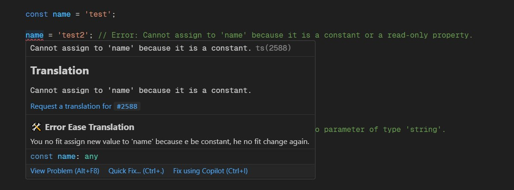

# Error Ease README

Error Ease is a VS Code extension designed to simplify error messages by translating them into user-friendly versions in your preferred language. With support for Yoruba, Pidgin English, and Simple English, this extension makes programming errors easier to understand and resolve. By presenting errors in a familiar language or dialect, Error Ease bridges the gap between technical jargon and intuitive problem-solving, helping developers debug with confidence in their mother tongue.

---

## Features

- **Simplified Error Messages**: Converts cryptic JavaScript/TypeScript error messages into clear, understandable language.
- **Multilingual Support**: Supports translations in Yoruba, Pidgin English, and Simple English.
- **Hover Integration**: Automatically displays translated error messages when hovering over an error.
- **Customizable Settings**: Users can select their preferred language in the extension settings.

### Example

**Original Error:**

```
> Expected 2 arguments, but got 3.
```

**Translated (Pidgin):**

```
> Dem dey expect 2 argument, but you give 3.
```

**Translated (Yoruba):**

```
> A reti 2 awọn ọrọ, ṣugbọn o gba 3.
```



---

## Requirements

- Visual Studio Code version 1.70.0 or later.

---

## Extension Settings

This extension contributes the following settings:

- `errorEase.language`: Sets the preferred language for error translations. Available options:
  - `Yoruba`
  - `Pidgin`
  - `SimpleEnglish`

To update the setting:

1. Open Command Palette (`Ctrl+Shift+P` or `Cmd+Shift+P`).
2. Search for "Preferences: Open Settings (JSON)".
3. Add the following:

```json
{
  "errorEase.language": "Pidgin"
}
```

---

## Known Issues

- Some errors may not match exactly due to subtle differences in phrasing. Efforts are ongoing to improve matching accuracy.
- Currently supports JavaScript/TypeScript errors only. Expanding to other languages in future updates.

---

## Release Notes

### 1.0.0

- Initial release of Error Ease.
- Core functionality for JavaScript/TypeScript error translations.
- Support for Yoruba, Pidgin English, and Simple English.
- Hover-based error message translations.

---

## Following Extension Guidelines

This extension adheres to the VS Code [Extension Guidelines](https://code.visualstudio.com/api/references/extension-guidelines).

---

## For more information

- [Visual Studio Code's Markdown Support](http://code.visualstudio.com/docs/languages/markdown)
- [Markdown Syntax Reference](https://help.github.com/articles/markdown-basics/)

**Enjoy Error Ease! Simplify your debugging experience today!**
